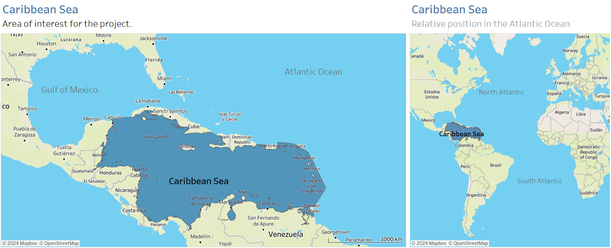
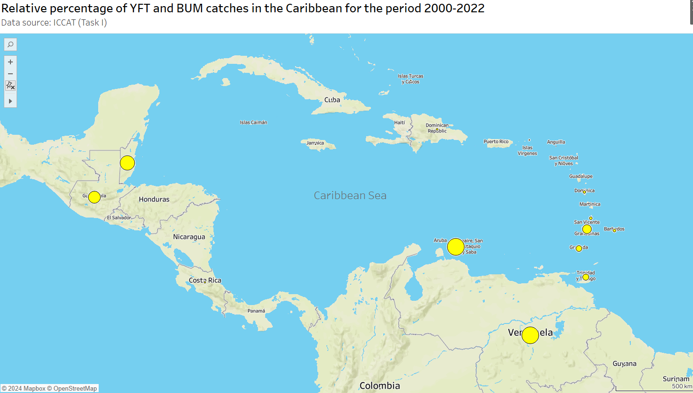
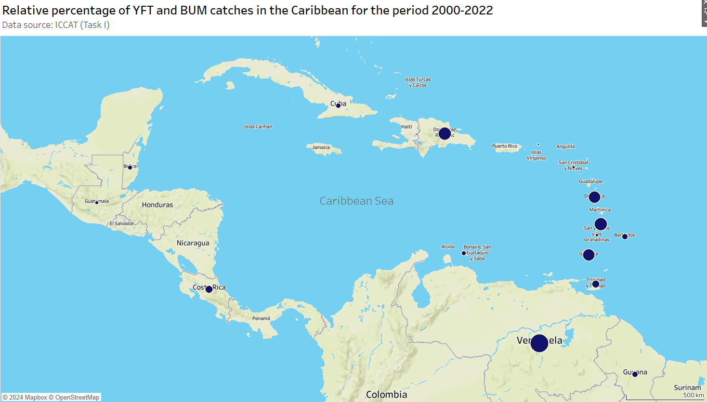
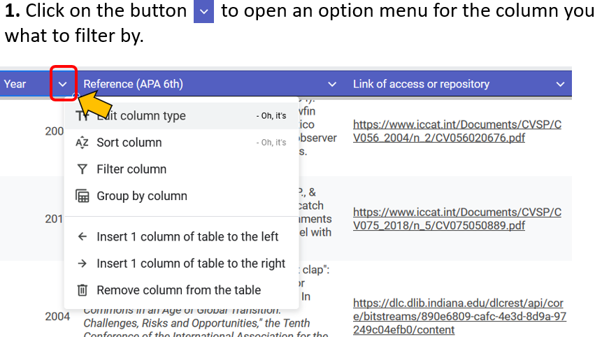
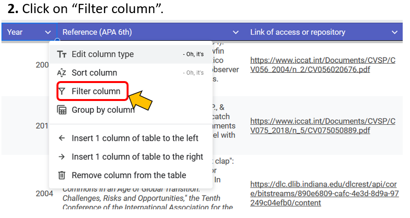
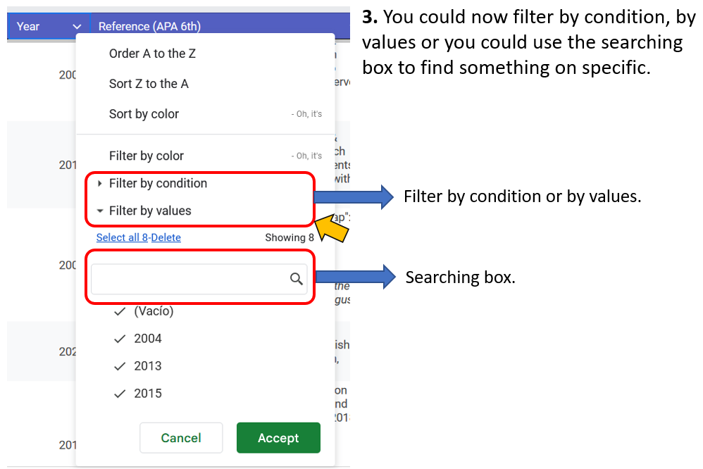

# Improving data collection systems and analysis of ICCAT fisheries in the wider Caribbean 
# - Phase 1 -
This project proposes to help the SCRS identify the most productive activities that can improve the reporting 
of catches and other fishery data from the Caribbean region. This pilot project proposes a series of activities 
to help define the scope for a more comprehensive set of future actions.  Five activities are proposed, the first 
three focus on ICCAT CPC members, and activities one and two use current information available in ICCAT databases 
or provided by countries in recent capacity-building workshops.  

Activity four expands the information sources beyond ICCAT and considers countries that are not CPCs.  The fifth 
and final activity develops a digital repository of all documents and information identified in the first four 
activities. This website is design to provide access to the mentioned digital repository.

# Area of study

Figure 1. Map that shows area covered by the Caribbean Sea, to view an interactive version of this map the 
Tableau Dashboard can be access on the next link: [Interactive Map of the Caribbean Sea](https://public.tableau.com/views/Caribbean_Sea_ICCAT/Dashboard1?:language=es-ES&publish=yes&:sid=&:redirect=auth&:display_count=n&:origin=viz_share_link)

# Species of interest
Yellofin tuna (*Thunnus albacares*) and blue marlin (*Makaira nigricans*) are the species of interest for the project, 
however the repository is not limited to those two species, as it also includes other species of interest for ICCAT.

# Relative percentage of Yellofin tuna (YFT, *Thunnus albacares*) and blue marlin (BUM, *Makaira nigricans*) catches for countries considered for the analysis

Figure 2. Map that shows the relative percentage of YFT catches for each country in the Caribbean region.

Figure 3. Map that shows the relative percentage of BUM catches for each country in the Caribbean region.

To view an interactive version of the maps the Tableau Dashboard can be access on the next link: [Interactive Map - YFT and BUM](https://public.tableau.com/shared/MTQDBFYXW?:display_count=n&:origin=viz_share_link) in which you can check the filter boxes to filter information by species.

# How to access the repositories
This repository can be access in two ways:
By checking below on this website the list of references, databases and websites (which includes links for direct access), 
or by opening the Google Sheets document [click here](https://docs.google.com/spreadsheets/d/1Zdjk6D-FWdcXfw-etrk46iC5y6dBT4MA88TSz4rz8nk/edit?usp=sharing) which has a list of all the files, websites and databases of the project repository, so you can use filter for each column or search, 
as you can see in the next step by step images:

# Official Websites
[Official ICCAT website](https://www.iccat.int/en/)

# Online databases with information on the Caribbean region
[SeaAroundUS estimated catch data for the Caribbean](https://www.seaaroundus.org/data/#/lme/12?chart=catch-chart&dimension=taxon&measure=tonnage&limit=10)

[FAO Global capture production Quantity (1950 - 2022)](https://www.fao.org/fishery/statistics-query/en/capture/capture_quantity)

[Access to ICCAT databases](https://www.iccat.int/en/accesingdb.html#)

# List of documents, files and links related to ICCAT species in the Caribbean
## Scientific papers, technical reports and other references:
Arocha, F., Pazos, A., Larez, A., Marcano, J., & Gutierrez, X. (2013). Enhanced monitoring of large pelagic fishes caught by the Venezuela Artisanal Off-shore Fleet targeting tuna and tuna-like species in the Caribbean Sea and adjacent northwestern Atlantic waters: A preliminary Analysis. Collect. Vol. Sci. Pap. ICCAT, 69(3), 1317-1332. [link of access](https://iccat.int/Documents/CVSP/CV069_2013/n_3/CV069031317.pdf)

Arocha, F., Larez, A., Pazos, A., Gutiérrez, X., Marcano, L. A., & Silva, J. (2015). Billfish catch in the Venezuelan artisanal off-shore pelagic longline fishery: past and present (1986–2013). Col. Vol. Sci. Pap. ICCAT, 71, 2203-2216. [link of access](https://www.iccat.int/Documents/CVSP/CV071_2015/n_5/CV071052203.pdf)

Arocha, F., Narvaez, M., & Mendoza, J. (2024). Review of biological data, spatial distribution of the stocks and ecological connectivity between areas beyond national jurisdiction and the exclusive economic zones in the Western Central Atlantic Fishery Commission region. Food & Agriculture Org. [link of access](https://www.fao.org/wecafc/publications/detail/en/c/1708734/)

Brown, C.A., Pastor, R.U., Sansores, R.S. (2004). Updating standardized catch rates for yellowfin tuna (Thunnus albacares) in the Gulf of Mexico longline fishery for 1992-2002 based upon observer programs from Mexico and the United States. ICCAT, 56(2), 676-685. [link of access](https://www.iccat.int/Documents/CVSP/CV056_2004/n_2/CV056020676.pdf) 

Charef, Aymen. (2018).  Review of data collection of fisheries statistics in the Republic of Trinidad and Tobago.  Report of Mission, 30 June to 9 July 2018 under Project GCP/INT/228/JPN “Improved fisheries management for sustainable use of marine living resources in the face of changing systems” and Project GCP/SLC/202/SCF “Climate Change Adaptation in the Eastern Caribbean Fisheries Sector- CC4FISH”. FAO. 29p.

Gentner, B. (2016). The value of billfish resources to both commercial and recreational sectors in the Caribbean. FAO Fisheries and Aquaculture Circular, (C1125), I.  [link of access](https://www.proquest.com/docview/1844303193?pq-origsite=gscholar&fromopenview=true&sourcetype=Scholarly%20Journals) 

Gentner, B., Arocha, F., Anderson, C., Flett, K., Obregon, P., & van Anrooy, R. (2018). Fishery performance indicator studies for the commercial and recreational pelagic fleets of the Dominican Republic and Grenada. FAO Fisheries and Aquaculture Circular, (C1162), I-68. [link of access](https://openknowledge.fao.org/server/api/core/bitstreams/b4984649-c9f5-4900-ad3c-eb659e95fb80/content) 

Grant, S., & Berkes, F. (2004). One hand can't clap": Combining scientific and local knowledge for improved Caribbean fisheries management. In Commons in an Age of Global Transition: Challenges, Risks and Opportunities," the Tenth Conference of the International Association for the Study of Common Property, Oaxaca, Mexico, August (pp. 9-13). [link of access](https://dlc.dlib.indiana.edu/dlcrest/api/core/bitstreams/890e6809-cafc-4e3d-8d9a-97249c04efb0/content) 

Mourato B.L., Hazin H., Hazin F., Travassos P., & Amorim A.F. (2018). Assessing blue marlin catch rates based on Brazilian sport fishing tournaments (1996-2018), using a generalized linear model with tweedie distribution. ICCAT,  75(5), 889-898. [link of access](https://www.iccat.int/Documents/CVSP/CV075_2018/n_5/CV075050889.pdf)

Vallès, H. & S. Varsamos. (2023). Caribbean Regional Management Plan for the Anchored Fish Aggregating Device (aFAD) Fishery. Bridgetown, FAO. 46 pp. [link of access](https://openknowledge.fao.org/server/api/core/bitstreams/57ab4d75-2e80-480f-b2ed-661f855223c4/content)

For more information or comments you could write an email to: caribbeandci@gmail.com
Updated: September 2024
